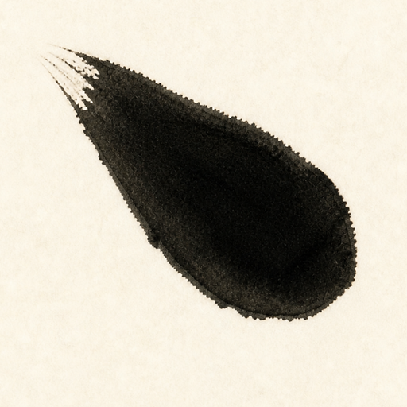

<div align="center">
  
  <h1>墨点 Inkdot</h1>
  <p><em>轻落一笔，清爽阅读。</em></p>
  <p>适用于 Windows 的极轻量 Markdown 与 Mermaid 阅读/编辑器</p>

  <a href="https://github.com/RickChen764/inkdot/releases/latest">
    
  </a>
  <a href="LICENSE">
    
  </a>
</div>

墨点使用 Windows 原生 Direct2D/DirectWrite 渲染，不携带浏览器内核。它启动迅速、保持单文件分发，并在 Tinta 的轻盈体验上加入 YAML Front Matter 渲染和中英文界面。

应用图标采用一枚真实书法侧点：露锋入纸、顿笔蓄墨，保留宣纸上的自然渗化与枯笔纹理。

## 下载

从 [Releases](https://github.com/RickChen764/inkdot/releases/latest) 下载便携版 `inkdot.exe`，无需安装。首次发布前也可以按下文从源码构建。

> Microsoft Store 版本尚未发布。墨点将使用独立的商店产品和包标识，不会复用 Tinta 的商店条目。

## 功能

- 原生 Direct2D/DirectWrite 硬件加速，无 Electron、无 WebView
- Markdown 阅读与专注编辑，支持实时预览、自动换行、搜索和文本选择
- YAML Front Matter 原生渲染：保留字段顺序、引号、缩进和多行文本
- Mermaid `flowchart`/`graph` 原生渲染，无需浏览器内核
- 10 套浅色/深色主题、目录、文件夹浏览和拖放打开
- 跟随 Windows 界面语言：简体中文系统显示中文，其他语言回退英文
- 单个便携可执行文件，目标体积低于 1 MB

## YAML Front Matter

文件顶部由 `---` 包围的元数据会显示为紧凑、跟随主题的等宽信息块，而不会混入正文：

```yaml
---
title: 项目笔记
tags: [Markdown, Windows]
author:
  name: Ada
draft: false
---
```

轻量解析器支持常见的映射、列表、嵌套值、流式集合、引号、注释以及 `|`/`>` 多行文本，不增加运行时依赖。元数据无效时会显示本地化错误，Markdown 正文仍可正常阅读和编辑。

## 快捷键

| 按键 | 功能 |
|---|---|
| `B` | 显示/隐藏文件夹浏览器 |
| `Tab` | 显示/隐藏目录 |
| `F` / `Ctrl+F` | 搜索 |
| `T` | 选择主题 |
| `Ctrl+E` | 进入编辑模式 |
| 双击 `Ctrl` / `?` | 显示完整快捷键提示面板 |
| `Esc` `Esc` | 退出编辑模式 |
| `Ctrl+S` | 保存 |
| `Ctrl+Z` / `Ctrl+Y` | 撤销 / 重做 |
| `Ctrl+X` / `Ctrl+V` | 剪切 / 粘贴 |
| `Ctrl+P` | 显示/隐藏预览 |
| `Ctrl+W` | 切换自动换行 |
| `Ctrl+滚轮` | 缩放 |
| `Q` | 退出 |

## 构建

需要 Windows、Visual Studio 2019 或更高版本，以及 CMake 3.15 或更高版本：

```pwsh
cmake -S . -B build
cmake --build build --config Release
ctest --test-dir build -C Release --output-on-failure
```

产物位于 `build/Release/inkdot.exe`。

## 使用

```pwsh
# 打开 Markdown 或 Mermaid 文件
inkdot.exe document.md
inkdot.exe diagram.mmd

# 使用浅色主题打开
inkdot.exe -l document.md

# 注册 .md、.markdown 和 .mmd 文件关联
inkdot.exe /register
```

设置独立保存在 `%APPDATA%\Inkdot\settings.ini`。如果首次运行时发现旧的 `%APPDATA%\Tinta\settings.ini`，墨点会将其作为初始设置导入，但之后两款应用互不影响。文件关联使用独立的 `Inkdot.MarkdownFile` 标识，因此可以和 Tinta 并存。

## 上游项目与许可

墨点基于 [oipoistar/Tinta](https://github.com/oipoistar/tinta) 修改，感谢原作者创建了这一轻巧的原生 Markdown 阅读器。本项目是独立维护的社区分支，与 Tinta 原项目及其作者不存在官方关联或背书关系。

源代码依据 [MIT License](LICENSE) 发布，并完整保留上游项目的原始版权声明。第三方依赖 [MD4C](https://github.com/mity/md4c) 在构建时由 CMake 获取。

---

<sub>English: Inkdot is an independent, lightweight Windows Markdown/Mermaid reader and editor derived from Tinta. It adds YAML Front Matter rendering and automatic Simplified Chinese localization. See the sections above for build and usage commands.</sub>
